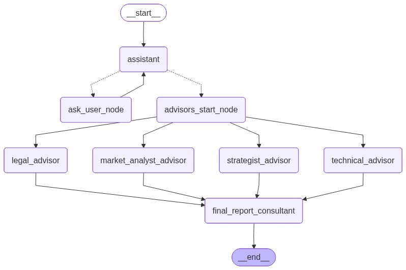
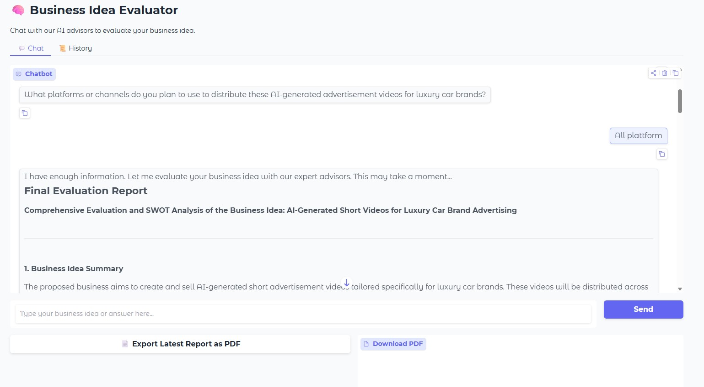
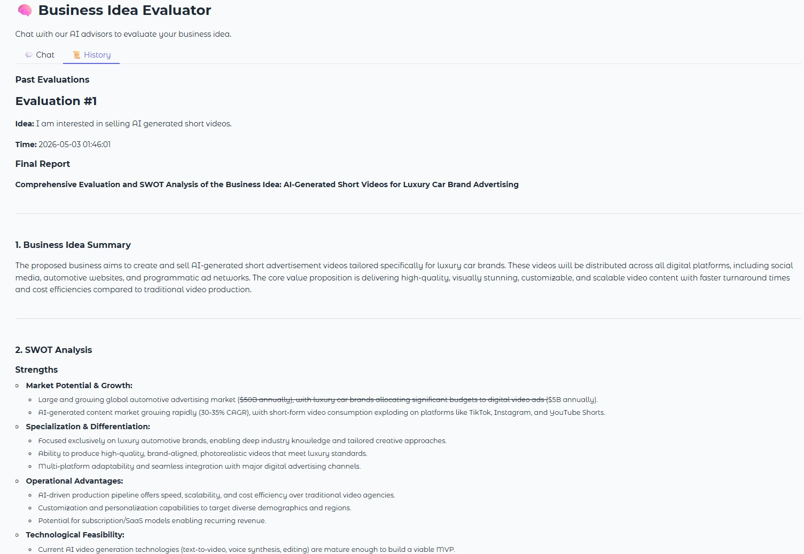

# Business Idea Evaluator

**Author: Chong Kiat Lim**

Multi-Agents AI that act as an Advisor to evaluate Business Idea enhanced by Human-in-the-Loop (HITL).

It is an AI system, teamed by multiple expert agents (e.g. Market Analyst, Legal Expert, Technical Advisor, Business Strategist), that helps founders evaluate (startup) business ideas from multiple expert perspectives in parallel.

---

## Architecture Overview

The Business Idea Evaluator is built using a multi-agent architecture powered by LangGraph. The system uses multiple expert AI agents that work in parallel to evaluate business ideas from different perspectives.

### Agent Graph



## Components

### 1. Human-in-the-Loop (HITL)

The system starts with a conversational assistant that gathers sufficient information about the business idea before routing to the expert advisors. It asks one follow-up question at a time until it determines it has enough context.

**Nodes:**
- `assistant` — Decides if enough information has been gathered
- `ask_user_node` — Prompts the user for more details
- `routing_function` — Routes to advisors when ready, or back to user for more info

### 2. Expert Advisors (Parallel Execution)

Once sufficient information is gathered, the system routes to 4 expert advisors that run **in parallel**:

| Advisor | Role |
|---------|------|
| **Market Analyst** | Evaluates market potential, competition, target customers, market sizing, trends |
| **Legal Advisor** | Identifies legal risks, regulatory requirements, IP considerations, compliance |
| **Technical Advisor** | Assesses technical feasibility, tech stack, scalability, security |
| **Business Strategist** | Evaluates business model, revenue streams, go-to-market strategy, competitive advantages |

### 3. Final Report Consultant

After all 4 advisors complete their analysis, a senior consultant synthesizes the reports into a comprehensive evaluation including:
- SWOT Analysis (Strengths, Weaknesses, Opportunities, Threats)
- Overall viability assessment
- Actionable recommendations

### 4. PDF Export

Reports can be exported as PDF documents containing:
- Title page with idea summary and timestamp
- Individual advisor reports (one section per advisor)
- Final consolidated report

## Project Structure

```
agentic-ai-business-idea-evaluator/
├── business_idea_advisor.py    # Main application (GUI + CLI)
├── BusinessIdeaEvaluator.ipynb # Jupyter notebook (development/exploration)
├── requirements.txt            # Python dependencies
├── .env                        # API keys (not committed)
├── reports/                    # Generated PDF reports
├── documents/
│   ├── IMPLEMENTATION.md       # Implementation details
│   ├── USAGE.md                # Usage guide
│   └── images/
│       ├── graph.png           # Agent graph visualization
│       ├── example_gui_chat.jpg
│       └── example_gui_history.jpg
└── tests/
    └── test_business_idea_advisor.py
```

## Key Design Decisions

1. **Parallel Advisor Execution** — All 4 advisors run simultaneously for faster evaluation
2. **Dual Interface** — Both GUI (Gradio) and CLI modes from a single codebase
3. **Session-based History** — Evaluations are stored in memory for the session duration
4. **Modular Architecture** — Each advisor is an independent function, easy to add/remove advisors
5. **Temperature 0** — Deterministic outputs for consistent business advice

---

## Prerequisites

1. Python 3.10+
2. OpenAI API key
3. (Optional) LangSmith API key for tracing

## Installation

```bash
# Clone the repository
git clone <repo-url>
cd agentic-ai-business-idea-evaluator

# Create and activate virtual environment
python -m venv .agenticai_venv
.agenticai_venv\Scripts\activate  # Windows
# source .agenticai_venv/bin/activate  # Linux/Mac

# Install dependencies
pip install -r requirements.txt
```

## Configuration

Create a `.env` file in the project root:

```env
OPENAI_API_KEY="your_openai_api_key_here"

# Optional: LangSmith tracing
LANGCHAIN_API_KEY="your_langsmith_api_key_here"
LANGSMITH_API_KEY="your_langsmith_api_key_here"
LANGSMITH_TRACING=true
LANGCHAIN_TRACING_V2=true
LANGSMITH_ENDPOINT="https://api.smith.langchain.com"
LANGSMITH_PROJECT="business-idea-evaluator"
```

## Running the Application

### GUI Mode (Gradio Web Interface)

```bash
python business_idea_advisor.py --mode gui
```

This launches a web-based chatbot interface at `http://localhost:7860`.



**How to use the GUI:**

1. Type your business idea in the text box and click **Send**
2. The assistant will ask follow-up questions — answer them to provide more context
3. Once enough information is gathered, the system automatically runs all 4 expert advisors
4. The **Final Evaluation Report** appears in the chat with a full SWOT analysis
5. After the report, you can type a new idea to start another evaluation
6. Click **Export Latest Report as PDF** to download the report

**History Tab:**



- Switch to the **History** tab to view all past evaluations
- Click **Refresh History** to update the display
- Export any past evaluation by entering its number and clicking **Export as PDF**

### CLI Mode (Terminal)

```bash
python business_idea_advisor.py --mode cli
```

**How to use the CLI:**

1. Enter your business idea when prompted
2. Answer follow-up questions from the assistant
3. Wait for all 4 advisors to generate their reports
4. Read the final consolidated report in the terminal
5. Choose whether to export as PDF
6. Choose whether to evaluate another idea

---

## Running Tests

```bash
pytest tests/ -v
```

---

## Tech Stack

| Skill | Description |
|-------|-------------|
| **Multi-Agent Systems** | Multiple specialized AI agents collaborating to solve a complex task |
| **Agentic AI Architecture** | Autonomous agents with defined roles orchestrated via a state graph |
| **LangGraph State Machines** | Directed graph-based workflow with nodes, edges, and conditional routing |
| **Parallel Agent Execution** | Multiple advisors running concurrently for efficiency |
| **Human-in-the-Loop (HITL)** | Interactive information gathering with iterative user feedback |
| **Conditional Routing** | Dynamic path selection based on LLM output (DONE vs. follow-up) |
| **Prompt Engineering** | Role-specific system prompts for each expert advisor |
| **LLM Orchestration** | Coordinating multiple LLM calls with LangChain and LangGraph |
| **Conversational AI** | Chatbot-style interaction with context-aware follow-up questions |
| **Report Synthesis** | Aggregating multiple AI-generated analyses into a unified SWOT report |
| **State Management** | TypedDict-based state with annotated reducers for message and report aggregation |
| **Memory & Checkpointing** | InMemorySaver for conversation persistence across graph invocations |
| **Observability** | LangSmith tracing integration for debugging and monitoring agent behavior |
